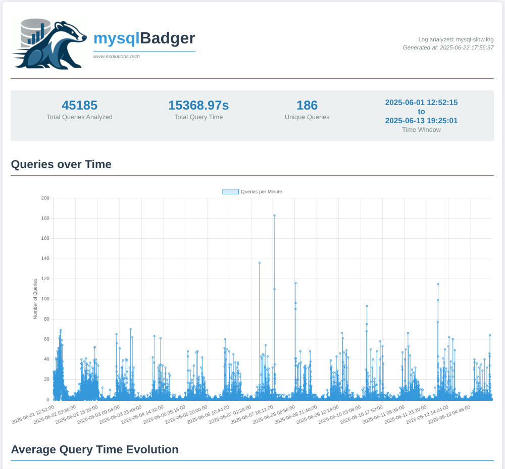
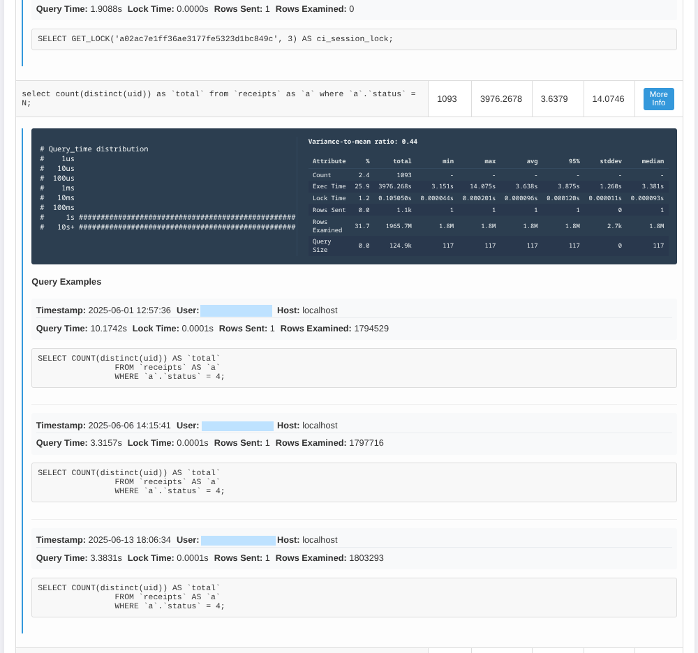

<div align="center">
  
  
  # 🦡 MySQL Badger
  
  **A powerful MySQL slow query log analyzer with comprehensive HTML reports**
  
  [](https://opensource.org/licenses/Apache-2.0)
  [](https://www.python.org/downloads/)
  [](#testing)
  
</div>

---

## 🎯 Overview

MySQL Badger is a comprehensive tool for analyzing MySQL slow query logs, inspired by the excellent pgBadger for PostgreSQL. It transforms your slow query logs into detailed, interactive HTML reports with statistical analysis and visualizations.

### ✨ Key Features

- 📊 **Comprehensive Statistics** - Real mathematical calculations (min, max, mean, median, 95th percentile, standard deviation)
- 📈 **Interactive Charts** - Query frequency and execution time trends over time
- 🔍 **Query Analysis** - Normalized queries with detailed execution patterns
- 📋 **Detailed Breakdowns** - Lock time, rows sent/examined, query size analysis
- 🎨 **Beautiful Reports** - Simple, responsive HTML interface
- ⚡ **Fast Processing** - Efficient parsing of large log files (to be tested with large logs actually)
- 🧪 **Tested** - Test suite with 27 unit tests

## 🚀 Quick Start

### Installation

```bash
# Clone the repository
git clone https://github.com/yourusername/mysqlBadger.git
cd mysqlBadger

# Install the CLI tool
cd packages/mysql_badger_cli
pip install -e .
```

### Basic Usage

```bash
# Generate a report from your slow query log
mysql-badger -f /path/to/mysql-slow.log -o report.html

# Open the generated report in your browser
open report.html
```

## 📊 Report Features

### Statistics Table
For each query, MySQL Badger calculates and displays:

| Attribute | pct | total | min | max | avg | 95% | stddev | median |
|-----------|-----|-------|-----|-----|-----|-----|--------|--------|
| **Count** | ✅ | ✅ | - | - | - | - | - | - |
| **Exec time** | ✅ | ✅ | ✅ | ✅ | ✅ | ✅ | ✅ | ✅ |
| **Lock time** | ✅ | ✅ | ✅ | ✅ | ✅ | ✅ | ✅ | ✅ |
| **Rows sent** | ✅ | ✅ | ✅ | ✅ | ✅ | ✅ | ✅ | ✅ |
| **Rows examined** | ✅ | ✅ | ✅ | ✅ | ✅ | ✅ | ✅ | ✅ |
| **Query size** | ✅ | ✅ | ✅ | ✅ | ✅ | ✅ | ✅ | ✅ |

### Visual Analysis
- **Time Series Charts** - Query frequency and average execution time over time
- **Query Distribution** - ASCII histograms showing execution time patterns
- **Top Queries** - Sorted by total time and frequency
- **Query Examples** - Real query samples with execution context

## 📷 Screenshots

<div align="center">
  
  <p><em>Example from generated HTML report</em></p>
</div>
<div align="center">
  
  <p><em>Example from generated HTML report</em></p>
</div>

## ⚙️ Advanced Usage

### Command Line Options

```bash
mysql-badger [OPTIONS]

Options:
  -f, --file PATH        Path to the MySQL slow query log file [required]
  -o, --output PATH      Output HTML report file [default: mysql-report.html]
  -t, --top-n INTEGER    Number of top queries to display [default: 10]
  --help                 Show this message and exit
```

### Example with Custom Settings

```bash
# Generate report with top 20 queries
mysql-badger -f /var/log/mysql/mysql-slow.log -o detailed-report.html -t 20
```

## 🧪 Testing

The project includes comprehensive tests covering all statistical calculations:

```bash
# Run all tests
cd packages/mysql_badger_cli
python -m pytest tests/ -v

# Run with coverage
python -m pytest tests/ --cov=src --cov-report=html
```

Test coverage includes:
- Statistical calculations (QueryStatistics class)
- Data parsing and aggregation
- Percentage calculations
- Edge cases (empty data, None values, duplicates)

## 🛠️ Development

### Setting Up Development Environment

```bash
# Clone and setup
git clone https://github.com/yourusername/mysqlBadger.git
cd mysqlBadger/packages/mysql_badger_cli

# Create virtual environment
python -m venv .venv
source .venv/bin/activate  # Linux/Mac
# or
.venv\Scripts\activate     # Windows, never tested btw

# Install development dependencies
pip install -e ".[dev]"
```

### Project Structure

```
mysqlBadger/
├── assets/images/           # Logo and documentation images
├── examples/               # Sample files for testing
│   ├── sample-slow.log     # Example MySQL slow query log
│   └── mysql_badger_report.html
├── packages/
│   └── mysql_badger_cli/   # Main CLI package
│       ├── src/            # Source code
│       ├── tests/          # Test suite
│       └── templates/      # HTML report templates
└── README.md
```

## 📋 Requirements

- **Python 3.7+**
- **Dependencies:**
  - `pandas` - Data analysis and manipulation
  - `Jinja2` - HTML template engine
  - `numpy` - Numerical computations

## 🤝 Contributing

Contributions are welcome! Please feel free to submit a Pull Request. For major changes, please open an issue first to discuss what you would like to change.

### Development Guidelines

1. **Fork the repository**
2. **Create a feature branch** (`git checkout -b feature/AmazingFeature`)
3. **Add tests** for new functionality
4. **Ensure all tests pass** (`pytest`)
5. **Commit your changes** (`git commit -m 'Add some AmazingFeature'`)
6. **Push to the branch** (`git push origin feature/AmazingFeature`)
7. **Open a Pull Request**

## 📚 Comparison with Other Tools

| Feature | MySQL Badger | pt-query-digest | mysqldumpslow |
|---------|--------------|-----------------|---------------|
| HTML Reports | ✅ | ❌ | ❌ |
| Statistical Analysis | ✅ | ✅ | ❌ |
| Time Series Charts | ✅ | ❌ | ❌ |
| Query Normalization | ✅ | ✅ | ✅ |
| Interactive Interface | ✅ | ❌ | ❌ |


## 📄 License

This project is licensed under the Apache License 2.0 - see the [LICENSE](LICENSE) file for details.

## 👥 Authors

- **Main Developer**: [Marian Simpetru](https://github.com/mosulache) | [eSolutions.tech](https://esolutions.tech)
- **Created with assistance from**: Danuța (💋)

## 🙏 Acknowledgments

- Inspired by [pgBadger](https://github.com/darold/pgbadger) - the excellent PostgreSQL log analyzer that I think is a must-have if you run any PostgreSQL database
- Built because pgBadger is the best tool of its kind, but there was no equivalent variant for MySQL. Though not yet as extensive as pgBadger, this project aims to fill that gap.
- Special thanks to Silviu and Emil

## 📞 Support

- **Documentation**: Check this README and inline code comments
- **Issues**: [GitHub Issues](https://github.com/yourusername/mysqlBadger/issues)
- **Discussions**: [GitHub Discussions](https://github.com/yourusername/mysqlBadger/discussions)

---

<div align="center">
  <sub>Built by <a href="https://esolutions.tech">eSolutions.tech</a> | 
  Explore our other <a href="https://github.com/esolutions-tech">open-source projects</a></sub>
</div> 